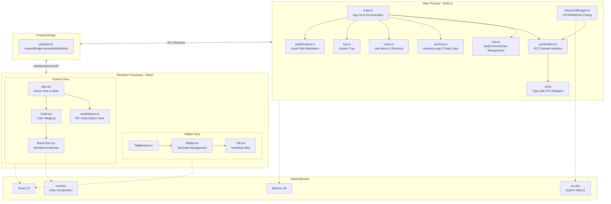
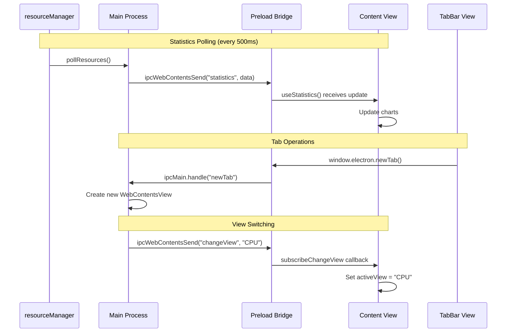
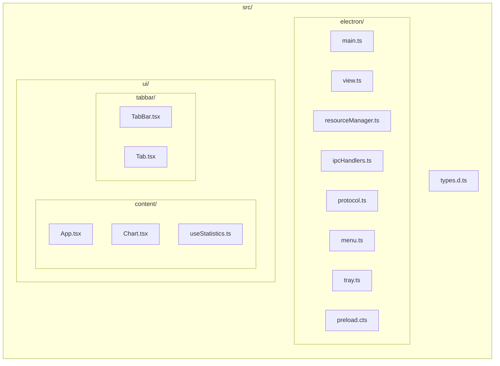

# Electron System Telemetry - Architecture

## Component Overview

```mermaid
graph TB
    subgraph Main["Main Process - Node.js"]
        entry["main.ts<br/>App Init & Orchestration"]
        views["view.ts<br/>WebContentsView Management"]
        resource["resourceManager.ts<br/>CPU/RAM/Disk Polling"]
        ipc["ipcHandlers.ts<br/>IPC Channel Handlers"]
        protocol["protocol.ts<br/>telemetry-app:// Deep Links"]
        menu["menu.ts<br/>App Menu & Shortcuts"]
        tray["tray.ts<br/>System Tray"]
        util["util.ts<br/>Type-safe IPC Wrappers"]
        pathResolver["pathResolver.ts<br/>Asset Path Resolution"]

        entry --> views
        entry --> ipc
        entry --> protocol
        entry --> menu
        entry --> tray
        entry --> pathResolver
        resource --> ipc
        ipc --> util
    end

    subgraph Preload["Preload Bridge"]
        preload["preload.cts<br/>contextBridge.exposeInMainWorld"]
    end

    subgraph Renderer["Renderer Processes - React"]
        subgraph TabBarView["TabBar View"]
            tabbarApp["TabBarApp.tsx"]
            tabbar["TabBar.tsx<br/>Tab State Management"]
            tab["Tab.tsx<br/>Individual Tabs"]
            tabbarApp --> tabbar
            tabbar --> tab
        end

        subgraph ContentView["Content View"]
            app["App.tsx<br/>Active View & Stats"]
            stats["useStatistics.ts<br/>IPC Subscription Hook"]
            chart["Chart.tsx<br/>Color Mapping"]
            basechart["BaseChart.tsx<br/>Recharts AreaChart"]
            app --> stats
            app --> chart
            chart --> basechart
        end
    end

    subgraph External["Dependencies"]
        osutils["os-utils<br/>System Metrics"]
        recharts["recharts<br/>Data Visualization"]
        react["React 19"]
        electron["Electron 35"]
    end

    Main <-->|"IPC Channels"| Preload
    Preload <-->|"window.electron API"| Renderer
    resource -.-> osutils
    basechart -.-> recharts
    ContentView -.-> react
    TabBarView -.-> react
    Main -.-> electron
```

## Data Flow

```mermaid
sequenceDiagram
    participant RM as resourceManager
    participant Main as Main Process
    participant Preload as Preload Bridge
    participant Content as Content View
    participant TabBar as TabBar View

    Note over RM,Content: Statistics Polling (every 500ms)
    RM->>Main: pollResources()
    Main->>Preload: ipcWebContentsSend("statistics", data)
    Preload->>Content: useStatistics() receives update
    Content->>Content: Update charts

    Note over TabBar,Main: Tab Operations
    TabBar->>Preload: window.electron.newTab()
    Preload->>Main: ipcMain.handle("newTab")
    Main->>Main: Create new WebContentsView

    Note over Main,Content: View Switching
    Main->>Preload: ipcWebContentsSend("changeView", "CPU")
    Preload->>Content: subscribeChangeView callback
    Content->>Content: Set activeView = "CPU"
```

## Directory Structure

```mermaid
graph LR
    subgraph src[" src/ "]
        subgraph electron[" electron/ "]
            main["main.ts"]
            view["view.ts"]
            rm["resourceManager.ts"]
            ipcH["ipcHandlers.ts"]
            proto["protocol.ts"]
            menuF["menu.ts"]
            trayF["tray.ts"]
            preloadF["preload.cts"]
        end
        subgraph ui[" ui/ "]
            subgraph content[" content/ "]
                appF["App.tsx"]
                chartF["Chart.tsx"]
                useStats["useStatistics.ts"]
            end
            subgraph tabbar[" tabbar/ "]
                tabBarF["TabBar.tsx"]
                tabF["Tab.tsx"]
            end
        end
        types["types.d.ts"]
    end
```
